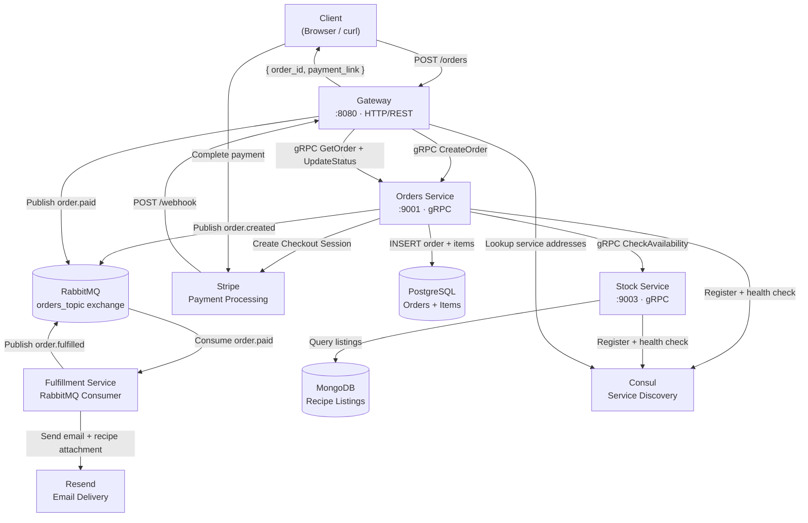

# Renta-Recipe

## Motivation
I have always wondered end to end how it was that stores were built from browsing to actually get your order. So I decided to take on this project of actually building a recipe market place. It fulfills the most essential components of the buying experience. 


Design and engineering wise this is a event-driven recipe marketplace built with Go microservices. Users browse recipes, purchase them via Stripe, and receive the recipe files via email upon payment confirmation.

**Live demo:** _deploy to add URL here_  
**Docker Hub:** [rgarcia2304](https://hub.docker.com/u/rgarcia2304)

---

## Architecture



---

## Services

| Service | Port | Protocol | Responsibility |
|---|---|---|---|
| Gateway | 8080 | HTTP/REST | Single entry point, routes requests, handles Stripe webhooks |
| Orders | 9001 | gRPC | Order lifecycle, Stripe checkout session creation, status management |
| Stock | 9003 | gRPC | Recipe listing availability checks, inventory management |
| Fulfillment | — | RabbitMQ | Consumes `order.paid`, delivers recipe via email attachment |

---

## Tech Stack

**Languages & Frameworks**
- Go 1.23 — all services
- gRPC + Protocol Buffers — inter-service communication
- sqlc — type-safe SQL query generation

**Infrastructure**
- PostgreSQL — transactional order data
- MongoDB — recipe listing catalog
- RabbitMQ — async event bus (`orders_topic` exchange, topic routing)
- Consul — service discovery and health checking
- Docker + Docker Compose — local development

**External APIs**
- Stripe — payment processing, hosted checkout, webhook verification
- Resend — transactional email with HTML recipe attachments

**CI/CD**
- GitHub Actions — build verification and Docker image publishing
- Docker Hub — image registry (`latest` + git SHA tags)

---

## Event Flow

```
POST /orders
    → Gateway validates request
    → Orders checks stock availability via gRPC
    → Orders inserts order + items in Postgres (transaction)
    → Orders creates Stripe Checkout Session
    → Orders publishes order.created to RabbitMQ
    → Gateway returns { order_id, payment_link }

User completes Stripe payment
    → Stripe sends checkout.session.completed webhook
    → Gateway verifies Stripe signature (HMAC)
    → Gateway fetches order (idempotency check — rejects if already paid)
    → Gateway updates order status → paid
    → Gateway publishes order.paid to RabbitMQ

Fulfillment consumes order.paid
    → Filters by routing key (ignores order.created, etc.)
    → Reads recipe HTML file from disk by listing ID
    → Sends email via Resend with recipe as attachment
    → Publishes order.fulfilled to RabbitMQ
```

---

## Key Design Decisions

**Synchronous Stripe integration**  
Stripe Checkout Session creation happens in the `CreateOrder` request path. This adds ~300ms latency but returns the payment link immediately — no polling or websockets required. Tradeoff: Orders service is coupled to Stripe availability.

**Idempotent webhook handling**  
Before processing `checkout.session.completed`, the Gateway fetches the current order status. If status is not `pending` the event is acknowledged and discarded. Protects against Stripe's at-least-once delivery guarantee.

**Topic exchange routing**  
RabbitMQ `orders_topic` exchange routes by pattern (`order.*`). Fulfillment filters by `delivery.RoutingKey == "order.paid"` — it does not process `order.created` events even though they arrive on the same queue.

**Dead letter queue**  
Failed messages are routed to `orders_dlx` exchange → `orders_dlq` queue via RabbitMQ dead letter configuration. Messages that fail processing are not lost.

**Consul service discovery**  
Services register on startup with TCP health checks. Gateway and Orders resolve peer addresses via Consul rather than hardcoded config. Requires `HOST_IP` env var since Consul runs in Docker and cannot reach `localhost` on the host machine.

**PostgreSQL enums vs TEXT**  
Order status is stored as a Postgres enum (`pending`, `paid`, `fulfilled`, `cancelled`). In retrospect TEXT + CHECK constraint would have been simpler — pgx null enum wrapper types (`NullOrderStatus`) added friction throughout the Go codebase with no meaningful benefit at this scale.


**Microservices vs Monolith**
This project is microservices by design choice, not necessity. The goal was to 
understand how distributed systems work at a production level — gRPC inter-service 
communication, event driven architecture, service discovery, distributed transactions.

For the actual use case a monolith would have been the correct technical decision. 
It would eliminate network latency between services, remove the need for Consul, 
simplify deployment, and reduce complexity significantly.
---

## Running Locally

**Prerequisites**
- Go 1.23+
- Docker + Docker Compose
- Stripe CLI
- `protoc` + Go protoc plugins

**1. Start infrastructure**
```bash
docker compose up -d
```

Starts: PostgreSQL, MongoDB, RabbitMQ, Consul

**2. Configure environment**
```bash
cp .env.example .env
# fill in:
# DATABASE_URL, MONGODB_URI, RABBITMQ_URL
# STRIPE_SECRET_KEY, STRIPE_WEBHOOK_SECRET
# RESEND_API_KEY
# HOST_IP (your machine's local IP, not localhost)
```

**3. Run migrations**
```bash
cd orders && go run ./cmd/migrate/main.go up
```

**4. Seed MongoDB**
```javascript
// mongosh
use recipe-marketplace
db.listings.insertOne({
  _id: "550e8400-e29b-41d4-a716-446655440000",
  name: "Grandma's Pasta",
  price: 9.99,
  quantity: 100
})
```

**5. Start services** (separate terminals)
```bash
cd stock      && go run main.go
cd orders     && go run main.go
cd gateway    && go run main.go
cd fulfillment && go run main.go
```

**6. Start Stripe webhook forwarding**
```bash
stripe listen --forward-to localhost:8080/webhook
```

**7. Place a test order**
```bash
curl -X POST http://localhost:8080/orders \
  -H "Content-Type: application/json" \
  -d '{
    "customer_id": "user123",
    "email": "you@example.com",
    "items": [{
      "listing_id": "550e8400-e29b-41d4-a716-446655440000",
      "quantity": 1,
      "price": 9.99
    }]
  }'
```

Complete payment at the returned `payment_link` using Stripe test card `4242 4242 4242 4242`.

---

## CI/CD Pipeline

```
On push to main:
  test    → go build ./... across all services
  build   → docker build + push to Docker Hub
            tagged as :latest and :<git-sha>
```

Images: `rgarcia2304/recipe-marketplace-{orders,stock,gateway,fulfillment}`

---

## Project Structure

```
recipe-marketplace/
├── commons/
│   ├── broker/       # RabbitMQ connection, publish, consume
│   ├── events/       # shared event schema (OrderCreatedEvent, OrderPaidEvent, etc.)
│   └── discovery/    # Consul registration and address lookup
├── proto/
│   ├── orders/       # orders.proto + generated Go code
│   └── stock/        # stock.proto + generated Go code
├── orders/
│   ├── db/           # sqlc generated queries
│   ├── handler/      # gRPC server implementation
│   ├── repository/   # database layer (Postgres)
│   └── service/      # business logic
├── stock/
│   ├── handler/      # gRPC server implementation
│   ├── repository/   # database layer (MongoDB)
│   └── service/      # business logic
├── gateway/
│   └── handler/      # HTTP handlers, Stripe webhook
├── fulfillment/
│   ├── api/          # Resend email client
│   ├── handler/      # RabbitMQ consumer
│   ├── recipes/      # HTML recipe files (served as email attachments)
│   └── service/      # fulfillment business logic
└── .github/
    └── workflows/
        └── ci.yml    # GitHub Actions pipeline
```

---

## What I Would Do Differently

- **TEXT + CHECK instead of Postgres enums** — pgx null enum types add complexity with no benefit at this scale
- **Separate Stripe into its own service** — Orders service currently does ordering AND payment session creation, violating single responsibility
- **`GetOrderWithItems` from the start** — `GetOrder` initially returned only the order row with no items, which caused issues when building the fulfillment event pipeline
- **`HOST_IP` env var documented earlier** — Consul's Docker networking requirement (can't reach host `localhost`) wasn't obvious until runtime
